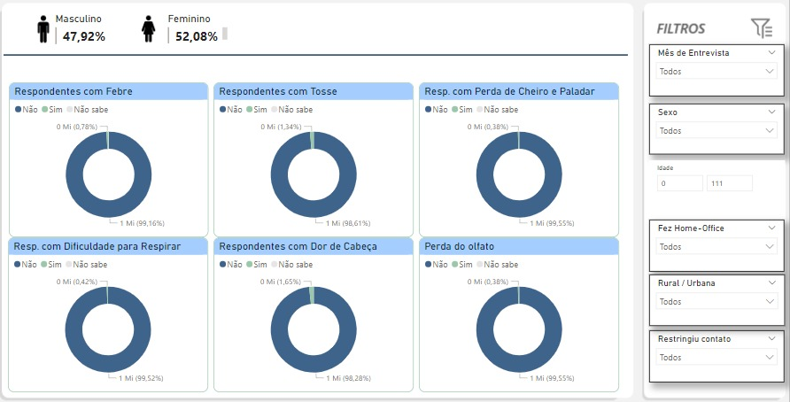
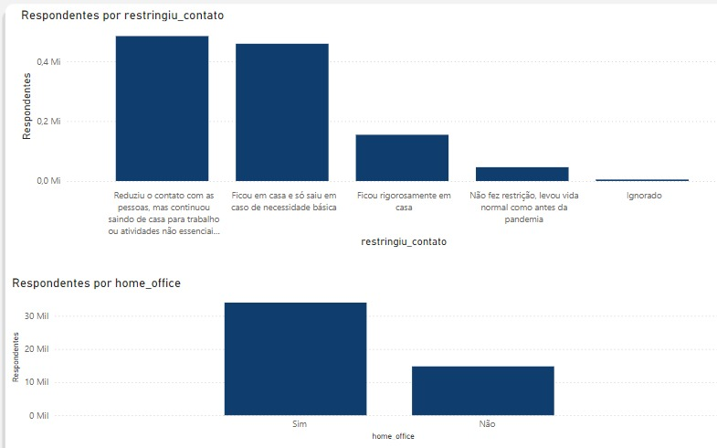
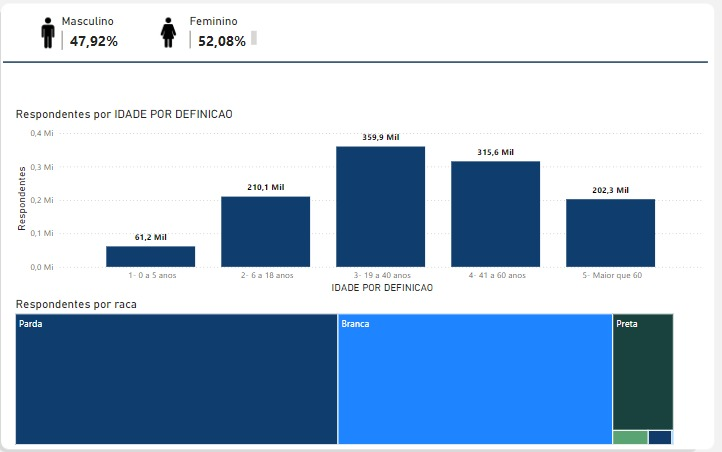
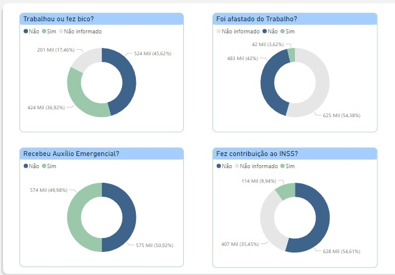
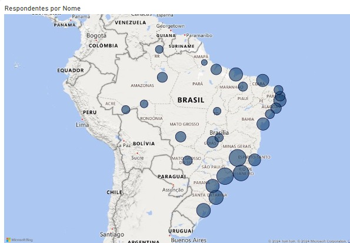

# TECH CHALLENGE - Fase 3 - Pós Tech Data Analytics - FIAP

O projeto consiste em atuar como Expert em Data Analytics para um grande hospital e entender como foi o comportamento da população na época da pandemia da COVID-19 e quais indicadores seriam importantes para o planejamento, caso haja um novo surto da doença.

Conforme especificações do projeto, buscamos a base de dados da Pesquisa Nacional por Amostra de Domicílios - [PNAD COVID-19](https://basedosdados.org/dataset/br-ibge-pnad-covid) do IBGE. Organizamos os dados a fim de atender o solicitado, conforme Anexo 1, prezando pelas seguintes premissas:

1. Utilização de no máximo 20 questionamentos realizados na pesquisa;  
2. Utilizar 3 meses para construção da solução;  
3. Caracterização dos sintomas clínicos da população;  
4. Comportamento da população na época da COVID-19, e   
5. Características econômicas da Sociedade.

## Organização do Banco de Dados

Os dados da PNAD COVID-19 foram organizados em torno de três categorias principais: sintomas clínicos da população, comportamento durante a pandemia e características econômicas.

Utilizamos os dados dos meses de **setembro, outubro e novembro de 2020**, atendo-se às perguntas que permitiram entender o impacto da pandemia na saúde, comportamento e condições econômicas da população.

A estruturação do banco foi feita utilizando as seguintes etapas:

1. Colab  
  * Limpeza dos dados: Tratamento de valores nulos nas colunas relacionadas aos sintomas clínicos, condições econômicas e comportamento, substituindo-os por valores como "Não informado" ou "Não", conforme a lógica de interpretação dos dados,   
  * Matriz de correlação: Algumas variáveis categóricas foram codificadas para permitir criar uma matriz de correlação (usando o Cramér's V).  
  * Seleção de variáveis mais relevantes: Para garantir uma análise direcionada e evitar sobrecarga de dados, selecionamos as perguntas mais eficazes com menor quantidade de dados faltantes e maior relevância clínica, econômica e comportamental.  
  * Exportação dos dados em csv. 
2. Power BI.
  * Importação dos dados em csv, e   
  * Criação de visualizações e filtros que permitiram uma segunda análise quanto aos grande números e a correlação das categorias selecionadas, conforme Anexo 02.

### Arquivos

- CSV com tratamento de dados para os períodos analisados: https://drive.google.com/file/d/1KWKyvPp40myTZ7Tk3DpTPq4C-VUDT-v6/view?usp=drive_link
- Arquivo Power BI (`.pbix`): https://github.com/alexandreaquiles/postech-fiap-dtat-tech-challenge-fase3/raw/refs/heads/main/dash%20covid%2019%20v2.pbix 
- Demais arquivo no Google Drive: https://drive.google.com/drive/folders/15ihR-xZGr4Xo5OqseWyWIZFiFuQ4khlz

## Perguntas Selecionadas e Justificativas

As perguntas selecionadas focaram em três pilares:

- Sintomas Clínicos da População
- Comportamento da População
- Características Econômicas da Sociedade

### Sintomas Clínicos da População

1. **Febre**  
2. **Tosse**  
3. **Perda de cheiro e sabor**  
4. **Dificuldade de respirar**  
5. **Dor de cabeça**  

**Por que essas perguntas?**: Os sintomas selecionados estão fortemente correlacionados entre si e representam os principais sintomas da COVID-19. São essenciais para determinar a gravidade da doença e orientar a necessidade de cuidados médicos imediatos.

### Comportamento da População

1. **Restringiu contato com outras pessoas?**  
2. **Estava em home office?**  

**Por que essas perguntas?**: A compreensão do comportamento da população em termos de distanciamento social e trabalho remoto é fundamental para entender as medidas preventivas adotadas e o impacto sobre a disseminação do vírus.

### Características Econômicas da Sociedade

1. **Trabalhou ou fez bico?**  
2. **Estava afastado do trabalho?**  
3. **Recebeu auxílio emergencial?**  
4. **Contribuição ao INSS**  


**Por que essas perguntas?**: As perguntas sobre a situação econômica da população nos fornecem uma visão sobre a vulnerabilidade social durante a pandemia. A relação entre trabalho informal, afastamento e o recebimento de auxílios governamentais reflete o impacto da crise sobre a subsistência e a estabilidade econômica.

## Análise: Principais Ações que o Hospital Deve Tomar

Com base nos dados analisados e nas correlações entre sintomas clínicos, comportamento e condições econômicas, o hospital deve se preparar para enfrentar um possível novo surto da COVID-19 por meio das seguintes ações:

* **Aumento da Capacidade de Internação e UTI**: Dada a correlação forte entre sintomas como febre, dificuldade respiratória e perda de olfato, o hospital deve garantir que haja leitos suficientes para pacientes com sintomas graves.  
* **Triagem Avançada de Sintomas**: A implementação de triagem automatizada para identificar múltiplos sintomas simultâneos (febre, tosse, etc.) permitirá o atendimento mais rápido de casos críticos e a separação dos pacientes com sintomas leves.  
* **Foco no Atendimento a Grupos Vulneráveis**: Pessoas que trabalham informalmente ou estão afastadas do trabalho devem ser priorizadas, pois possuem maior vulnerabilidade econômica e podem ter dificuldades em acessar o sistema de saúde.  
* **Educação e Prevenção**: Campanhas de conscientização sobre distanciamento social e práticas preventivas são fundamentais para reduzir a disseminação do vírus, mesmo com a fraca correlação observada entre sintomas e comportamento preventivo.  
* **Telemedicina**: Deve ser ampliado o uso de teleconsultas para monitorar sintomas leves e orientar a população sem sobrecarregar os recursos hospitalares.

## Anexo 01 - Dados do SQL

Os dados da pesquisa PNAD COVID-19 de três meses (setembro, outubro e novembro de 2020), foram estruturados em código SQL no BigQuery com base nas perguntas que possuíam dados mais eficazes e com menor quantidade de nulos.

Microdados da PNAD-COVID.

Website: [https://basedosdados.org/dataset/br-ibge-pnad-covid](https://basedosdados.org/dataset/br-ibge-pnad-covid)

Consulta (Query):

```sql
SELECT  
  a.ano,
  a.mes,
  PARSE_DATE('%Y-%m-%d', CONCAT(CAST(ano AS STRING), '-', LPAD(CAST(mes AS STRING), 2, '0'), '-01')) AS data_entrevista,


  -- Características econômicas da sociedade


  a.sigla_uf AS uf,
  b.valor AS sit_domicilio,  -- Situação do domicílio
  a.a002 AS idade,  -- Mantém como numérico
  c.valor AS sexo,
  d.valor AS raca,
  e.valor AS escolaridade,
  n.valor AS aposentadoria_pensao,  -- Recebimento de aposentadoria ou pensão
  o.valor AS auxilio_emergencial,   -- Recebimento de auxílio emergencial
  p.valor AS seguro_desemprego,     -- Recebimento de seguro-desemprego
  q.valor AS trabalhou_bico,        -- Trabalhou ou fez bico
  r.valor AS afastado_trabalho,     -- Estava afastado do trabalho
  s.valor AS contribuicao_inss,     -- Contribuição para o INSS


  -- Sintomas clínicos da população


  f.valor AS perda_cheiro_sabor,    -- Perda de cheiro ou de sabor
  g.valor AS febre,                 -- Febre
  h.valor AS tosse,                 -- Tosse
  i.valor AS dif_respirar,          -- Dificuldade para respirar
  j.valor AS dor_de_cabeca,         -- Dor de cabeça
  k.valor AS est_de_saude,          -- Busca por estabelecimento de saúde
  l.valor AS internacao,            -- Internação por COVID-19
 
  -- Comportamento da população


  t.valor AS plano_saude,           -- Possui plano de saúde
  u.valor AS restringiu_contato,    -- Restringiu contato com outras pessoas
  v.valor AS home_office            -- Estava em home office


FROM `basedosdados.br_ibge_pnad_covid.microdados` AS a


-- JOINs para as variáveis de características econômicas


LEFT JOIN `basedosdados.br_ibge_pnad_covid.dicionario` AS b
ON a.v1022 = b.chave AND b.nome_coluna = 'v1022'
LEFT JOIN `basedosdados.br_ibge_pnad_covid.dicionario` AS c
ON a.a003 = c.chave AND c.nome_coluna = 'a003'
LEFT JOIN `basedosdados.br_ibge_pnad_covid.dicionario` AS d
ON a.a004 = d.chave AND d.nome_coluna = 'a004'
LEFT JOIN `basedosdados.br_ibge_pnad_covid.dicionario` AS e
ON a.a005 = e.chave AND e.nome_coluna = 'a005'
LEFT JOIN `basedosdados.br_ibge_pnad_covid.dicionario` AS n
ON a.d0011 = n.chave AND n.nome_coluna = 'd0011'
LEFT JOIN `basedosdados.br_ibge_pnad_covid.dicionario` AS o
ON a.d0051 = o.chave AND o.nome_coluna = 'd0051'
LEFT JOIN `basedosdados.br_ibge_pnad_covid.dicionario` AS p
ON a.d0061 = p.chave AND p.nome_coluna = 'd0061'
LEFT JOIN `basedosdados.br_ibge_pnad_covid.dicionario` AS q
ON a.c001 = q.chave AND q.nome_coluna = 'c001'
LEFT JOIN `basedosdados.br_ibge_pnad_covid.dicionario` AS r
ON a.c002 = r.chave AND r.nome_coluna = 'c002'
LEFT JOIN `basedosdados.br_ibge_pnad_covid.dicionario` AS s
ON a.c014 = s.chave AND s.nome_coluna = 'c014'


-- JOINs para as variáveis de sintomas clínicos


LEFT JOIN `basedosdados.br_ibge_pnad_covid.dicionario` AS f
ON a.b00111 = f.chave AND f.nome_coluna = 'b00111'
LEFT JOIN `basedosdados.br_ibge_pnad_covid.dicionario` AS g
ON a.b0011 = g.chave AND g.nome_coluna = 'b0011'
LEFT JOIN `basedosdados.br_ibge_pnad_covid.dicionario` AS h
ON a.b0012 = h.chave AND h.nome_coluna = 'b0012'
LEFT JOIN `basedosdados.br_ibge_pnad_covid.dicionario` AS i
ON a.b0014 = i.chave AND i.nome_coluna = 'b0014'
LEFT JOIN `basedosdados.br_ibge_pnad_covid.dicionario` AS j
ON a.b0015 = j.chave AND j.nome_coluna = 'b0015'
LEFT JOIN `basedosdados.br_ibge_pnad_covid.dicionario` AS k
ON a.b002 = k.chave AND k.nome_coluna = 'b002'
LEFT JOIN `basedosdados.br_ibge_pnad_covid.dicionario` AS l
ON a.b005 = l.chave AND l.nome_coluna = 'b005'


-- JOINs para as variáveis de comportamento


LEFT JOIN `basedosdados.br_ibge_pnad_covid.dicionario` AS t
ON a.b007 = t.chave AND t.nome_coluna = 'b007'
LEFT JOIN `basedosdados.br_ibge_pnad_covid.dicionario` AS u
ON a.b011 = u.chave AND u.nome_coluna = 'b011'
LEFT JOIN `basedosdados.br_ibge_pnad_covid.dicionario` AS v
ON a.c013 = v.chave AND v.nome_coluna = 'c013'


WHERE PARSE_DATE('%Y-%m-%d', CONCAT(CAST(ano AS STRING), '-', LPAD(CAST(mes AS STRING), 2, '0'), '-01'))
      IN ('2020-11-01', '2020-10-01', '2020-09-01')
ORDER BY data_entrevista;
```

## Anexo 02 - Visualizações em Power BI

#### Visualização das respostas relacionadas aos principais sintomas da COVID-19

É interessante notar o baixo número de respostas positivas em relação aos sintomas.



#### Visualização das respostas relacionadas ao comportamento das pessoas durante a pandemia

É notório que a resposta mais comum é que as pessoas reduziram contato, porém continuaram saindo para trabalho e/ou atividades essenciais e/ou recebendo visitas.



#### Visualização das características da população entrevistada quanto à idade e raça

Podemos notar que 90% dos entrevistados se consideram brancos ou pardos. Quanto à faixa etária, o grupo de 19 a 60 anos representa 59% dos entrevistados.



#### Visualização das características econômicas dos entrevistados durante a pandemia

É possível perceber que metade (50,02%) da população entrevistada recebeu auxílio emergencial. 



#### Visualização de locais de moradias das pessoas entrevistadas

Em suma, notamos que, apesar de serem entrevistadas pessoas do Brasil inteiro, as regiões Sul e Sudeste foram as mais representadas.


